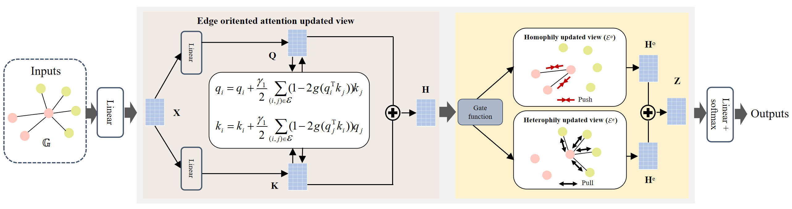

# Contrastive message passing for robust graph neural networks with sparse labels
Pytorch implementation for the paper "Contrastive message passing for robust graph neural networks with sparse labels".

## Abstract
Graph Neural Networks (GNNs) have achieved great success in semi-supervised learning. Existing GNNs typically aggregate the features via message passing with the aid of rich labels. However, real-world graphs have limited labels, and overfitting weakens the classification ability when labels are insufficient. Besides, traditional message passing is sensitive to structure noise, such as perturbations on edges. The performance of GNNs would drop sharply when trained on such graphs. To mitigate these issues, we present a noise-resistant framework via contrastive message passing. Except for the limited labelled nodes as supervision widely used in GNNs, we model the topology structure by graph likelihood as extra supervision. Specifically, we first propose contrastive graph likelihood, which is defined as a product of the edge likelihood on all connected node pairs. Then, we apply two unfolding updated steps via descent iterations. The first step updates the features in a single view with the aid of initializing the edge probability. Then the second step applies a binary edge for homophily and heterophily views, respectively. The homophily view applies attractive force to pull the positive-connected nodes close; otherwise, the heterophily view utilizes repulsive force to push away the negative-connected nodes. Extensive experiments show that our method has superior performance on semi-supervised node classification tasks with sparse labels and excellent robustness under perturbations in structure.




## Training baselines
For GCN,GAT,GraphSage, GPRGNN,BernNet, run the following command to obtain the experimental results:
    
   cd Baselinenets/

    python  baselinemain.py   --dataset xxx   --lr 0.001  --weight_decay 0  --net xx

## Training CMPGNN
Taking the dataset Photo as an example, run the following command to obtain the experimental results:
    
    python traincmpgnn.py   --dataset  Photo    --lr 0.001  --weight_decay  5e-5  --dropout 0.5      --train_rate 0.6    --K=2        --step1=2.0    --step2=0.01


## Codes and datasets
The implementation of this code is largely built upon [BernNet](https://github.com/ivam-he/BernNet) and [FAGCN](https://github.com/bdy9527/FAGCN)

Following the guidance of BernNet, the datasets are splits in different parts including training set, validation set and testing set. In the project, Changing the ' --train_rate ' and ' --val_rate ' parameters will directly change the different sample splits. For example, ' --train_rate=0.6 ' and ' --val_rate=0.2 ' will result in a 60% 20% 20% training, validation and test set split. In our experiment, --val_rate takes a fixed value of 0.2, and --train_rate takes a value from {0.1, 0.2, 0.3, 0.4, 0.5, 0.6 }. The rest is divided into the test set.


## Contact
If you have any questions, feel free to contact Yuan Gao through [Email](maxgaoyuan@njust.edu.cn) or Github issues. Pull requests are highly welcomed!


## Citation
```bibtex

```